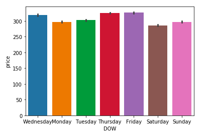
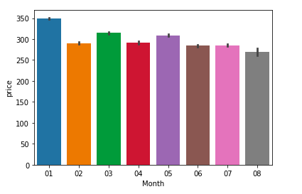
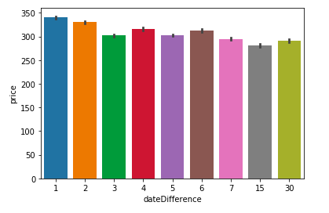

# Predicting Flight Prices From Beijing <-> Shanghai

## Goal 
Create a prediction model to predict flight prices from Beijing to Shanghai and vice versa, in order to help prospective flyers take advantage of variables that lead to cheaper ticket prices. 

## Repository

## Process

#### Data Acquisition 
We acquired the data for this model from the following [kaggle data set](https://www.kaggle.com/lpisallerl/air-tickets-between-shanghai-and-beijing#sha-pek.csv).\
The data set contains one way ticket prices from Beijing to Shanghai and vice versa from January 2019 to August 2019.

#### Data Cleaning/Feature Engineering 
We feature engineered the following variables, due to our domain knowledge in the subject matter and what we thought would impact prices. \
  - Layover - 0 implying a direct flight, 1 implying a non-direct flight
  - cabinClass - Class the seat was in; F-First class, C-Business class, Y-Economy 
  - dateDifference - Days in advance ticket was purchased.
  - TODD - Time of day departure took place; M - 6am-Noon; A - Noon-6pm; N - 6pm-Midnight
  - Month - Month the flight departed in.
  - DOW - Day of week the flight departed.
  - MOPD - Month the ticket was purchased.
  - DOPD - Day of the week the ticket was purchased.
  - TOPD_L - Time of day ticket was purchased; EM - Midnight-6am; M - 6am-Noon; A - Noon-6pm; N - 6pm-Midnight
  
#### EDA 
We inspected Features vs Price to check for impact of the various features on the target variable.\
A few highlights below. \

#### Modeling
We chose to use the Multiple Linear Regression model for its feature interpretability.\
OLS model produced an RMSE of 132 and R^2 of 0.71. 
  
#### Actionable Insights
Check [Slides](https://docs.google.com/presentation/d/1n0zjTuZW-0FHeArEZXLCu_cRxrCmemVM7iX11LGqBQg/edit?usp=sharing) pages 4 and 8.
  
## Further Work
Gather around 10 million data points for the model and have the data span outside the timeline of Jan 2019 to August 2019. 
## Credits 
This project was completed by Jigme Sherpa and Raam Levy.
